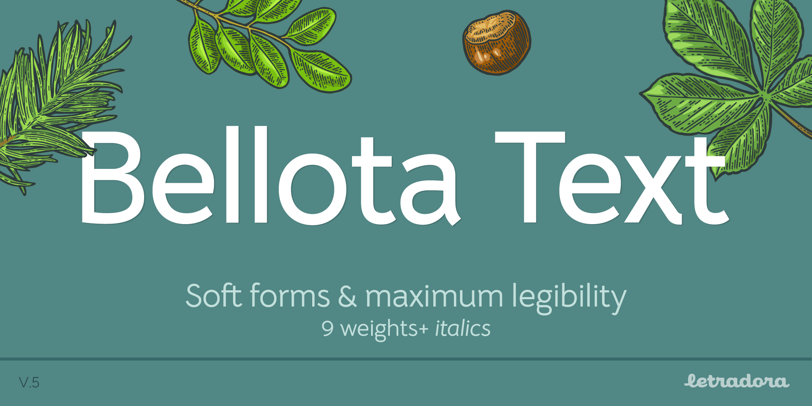
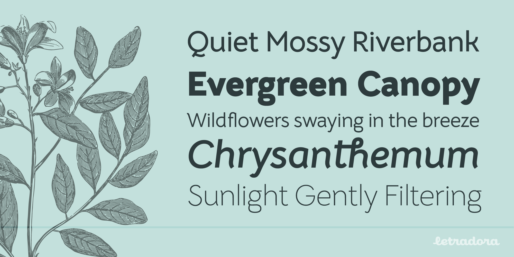
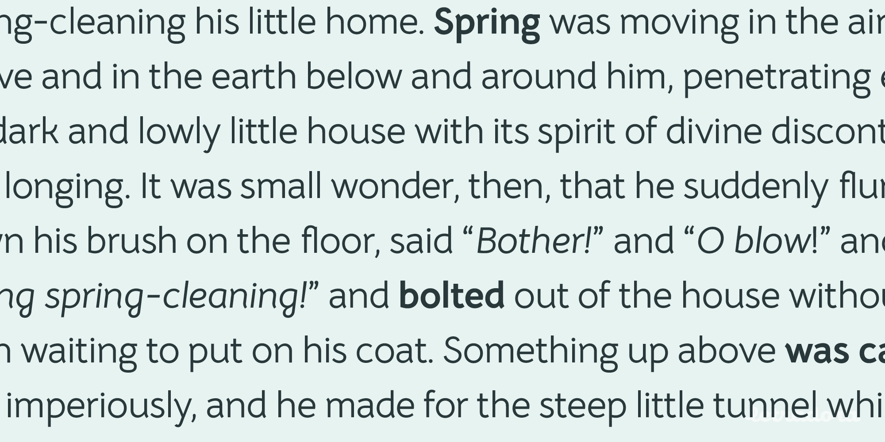
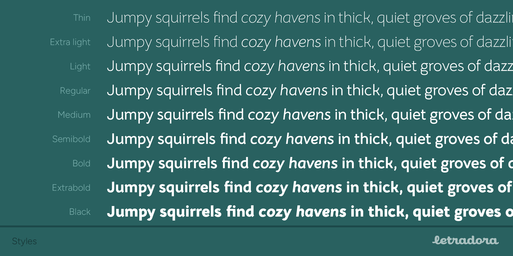
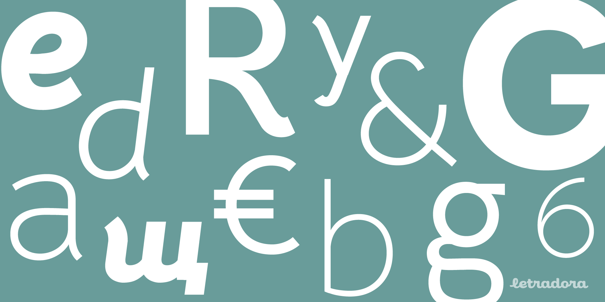
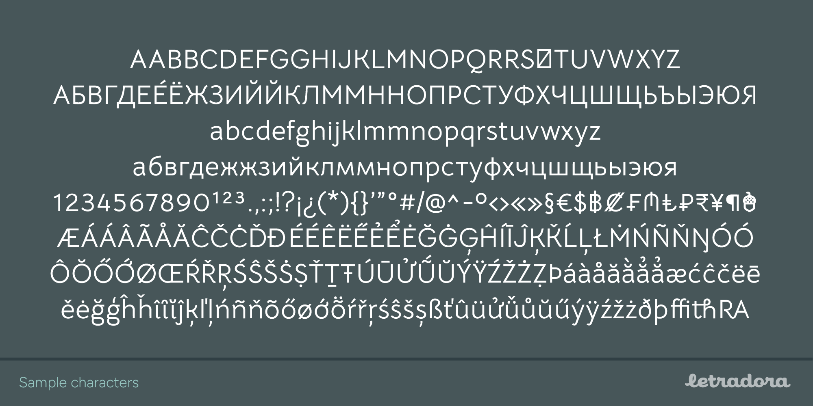
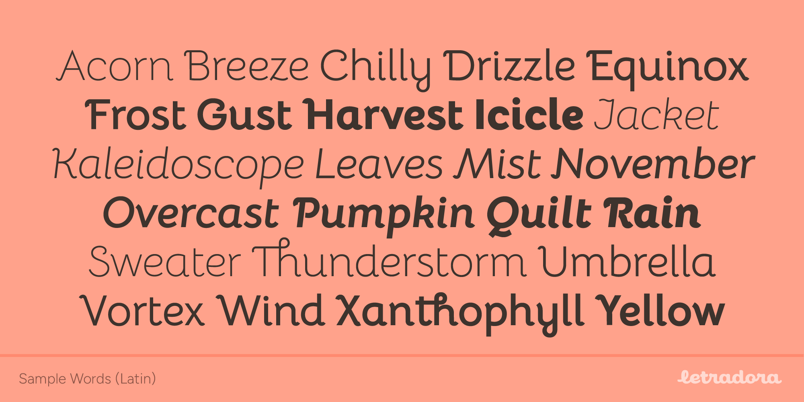
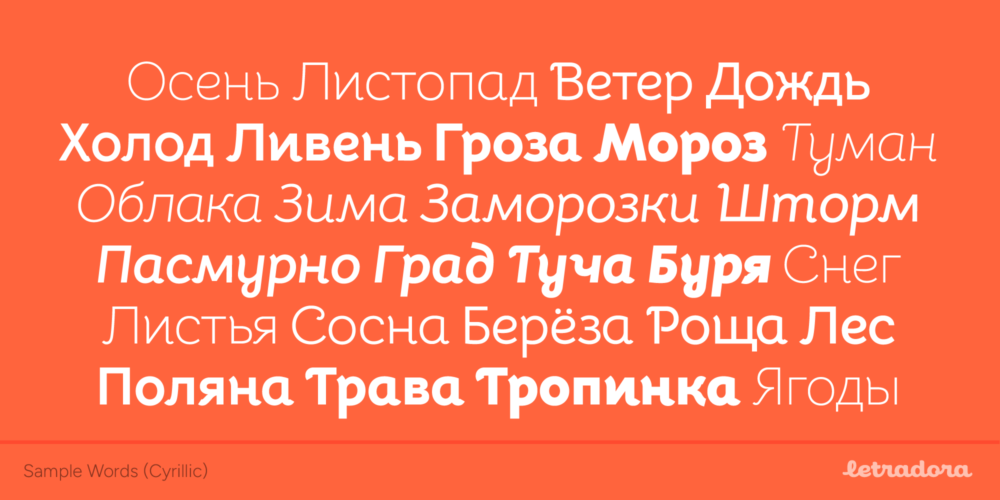
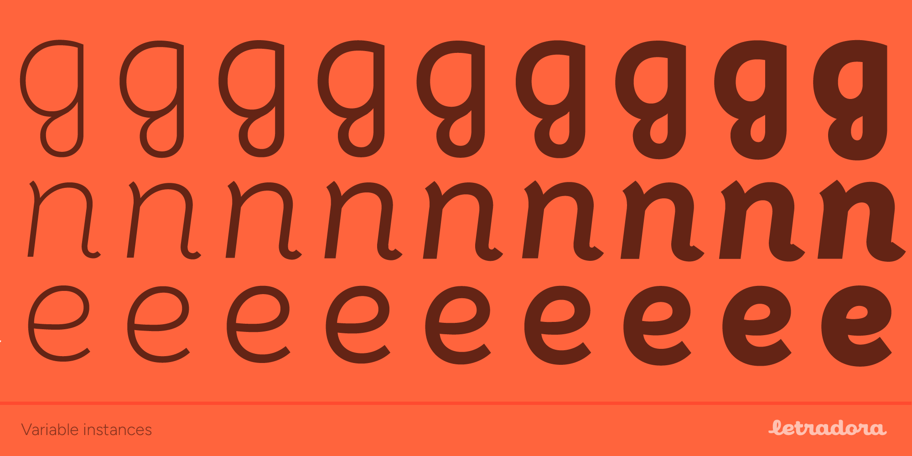

Bellota & Bellota Text font families
==============================

Bellota is an ornamented, low contrast sans-serif with swash alternates. It’s just cute enough!

It comes in two subfamilies: **Bellota** and **Bellota Text**. Each of these comes in 9 weights (thin, extralight, light, regular, medium, semibold, bold, extrabold, black) with their corresponding italics. Bellota also comes as a variable font. 

Bellota has stylistic alternate sets and ligatures available through opentype features.

* Stylistic Style1: Text
* Stylistic Style 2: Swash caps

Bellota supports most latin languages and basic cyrillic

Bellota is based on the font "Snippet" by Gesine Todt (www.gesine-todt.de)

To contribute to the project contact  Kemie Guaida at [hi@letradora.com](mailto://hi@letradora.com)

# License	  
The **Bellota Family** is licensed under the [SIL Open Font License Version 1.1](http://scripts.sil.org/OFL). The Open Font License is a free software license, and as such permits the fonts to be used, modified, and distributed freely (so long as the resulting fonts remain under the Open Font License). 

In other words, you are free to use it for any purpose, commercial included.

If you remix or modify the font, I'd love to hear about it!.

# Build
Because Bellota uses components that `fontmake` cannot currently build (as of Jan. 2020) such as corner components, we’re using a partially automated build process.
To generate correct TTFs, export TTFs directly out of Glyphs.app (remove overlaps, autohint), then run the partial build script `build.sh` to change a few things regarding the hinting settings.

# Changelog	
————————————————————————————————
## V 5.04, Dec 2025
+ Better spacing
+ Changed masters medium-->regular
+ Fixed some outline errors

## v5.0, Sept 2024
+ Expanded weights: thin to black
+ Variable font support
+ Better spacing and kerning
+ Better consistency on character outlines
+ Expanded character set 

## v4.1, Jan 2020
+ Bumped to Google Fonts specs 

## v4.0, Oct  2019 
+ Basic Cyrillic support
+ Better Vietnamese diacritics
+ Wider character coverage
+ Better spacing and kerning
+ Better consistency on character outlines
+ Added Swash characters
+ Changed Stylistic Set 2 to 1

## v3.0, May 2017
+ Better spacing and kerning
+ Fixed some character outlines
+ Added more characters to Stylistic Set 2
+ Fixed vertical metrics 
## v2.5, June 2015
+ First uploaded to GitHub
+ Added support for Vietnamese
+ Minor fixes.

# Questions? Comments?
The font was made and is maintained by [Kemie Guaida](https://www.letradora.com). 

If you have questions or suggestions, you can open an issue here at github, or ping me via instagram [@kemie](https://www.instagram.com/kemieg/)

